# Dog Spotting App

A full-stack app that allows users to share, like, and rate their daily dog spots with a community of fellow dog enthusiasts.

# Description

Dog Spotting App is a MEN (MongoDB, Express, Node.js) stack CRUD app where users can document and share dogs they've spotted in their daily lives. The platform features user authentication, photo uploads, social engagement through likes, and a rating system. This is my second project in my three-month intensive bootcamp at General Assembly.

# Deployment Link

🐕  The App: [DogSpotting](https://dogspotting.netlify.app/)

# Timeframe & Working Team

## Timeframe: 1 week (solo project)

| Time | Task 
|:-----| :-----
| Days 1-2 | Planning (user stories, ERD, wireframes, Figma prototypes)
| Days 3-4 | Core CRUD functionality and authentication 
| Day 5 | Ratings feature and Cloudinary integration
| Day 6 | Styling and responsive design
| Day 7 | Testing, bug fixes, deployment, ReadMe

# Technologies Used

## Backend:

- MongoDB - NoSQL database
- Express.js - Web application framework
- Node.js - JavaScript runtime environment
- Mongoose - MongoDB object modeling
- bcrypt - Password hashing
- Express-session - Session management
- Multer - File upload middleware
- Cloudinary - Image hosting service

## Frontend:

- EJS (Embedded JavaScript Templates) 
- HTML5
- CSS3
- JavaScript (ES6)

## Development & Design Tools:

- Figma - UI/UX design and prototyping
- Miro - Wireframing and diagrams
- Trello - Project management

## Deployment:

- Netlify

## Features

- User Authentication: Secure sign-up, sign-in, and sign-out functionality with session-based authentication
- CRUD Operations: Create, read, update, and delete dog spotting posts
- Photo Uploads: Upload and display dog photos via Cloudinary integration
- Social Engagement: Like other users' dog spots
- Rating System: Rate dog spots and see all ratings from the community
- Personal Dashboard: View all your posted spots and liked dogs in one place
- Authorization: Protected routes ensure only authenticated users can create, edit, or delete content
- Responsive Design: Mobile-friendly interface with hamburger menu navigation

## Brief

The project requirements included:

- EJS Templates for rendering views
- Session-based authentication
- Organized file structure following MVC conventions
- At least one data entity (Dog) in addition to User model
- Relationship between Dog and User models
- Full CRUD functionality
- Authorization to protect routes from unauthorized access
- Online deployment

# Planning

User Stories

- The planning phase began with defining user stories to map out the complete user journey from initial visit to active engagement with the platform.

Entity Relationship Diagram (ERD)

- Created an ERD to visualize the relationships between Users and Dogs, including embedded subdocuments for ratings.

Wireframes

- Developed wireframes in Miro to establish the basic layout and user flow through the application.

Design Prototype

- Built interactive prototypes in Figma for the web version to finalize the visual design before development.

Project Management

- Used Trello to organize tasks, track progress, and manage the project timeline effectively.

# Build Process

1. Core CRUD Functionality
   
Implemented the foundational routes for creating, reading, updating, and deleting dog spots, along with the Dog and User model schemas.

| Delete Modal | Show Dog | Welcome Page | 
|---------------------|---------------------|---------------------|
| 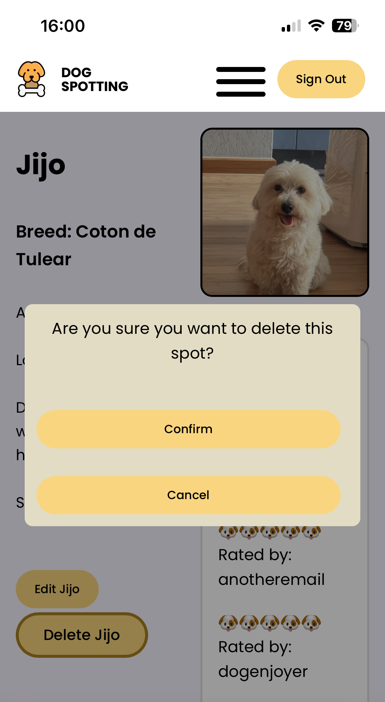 | 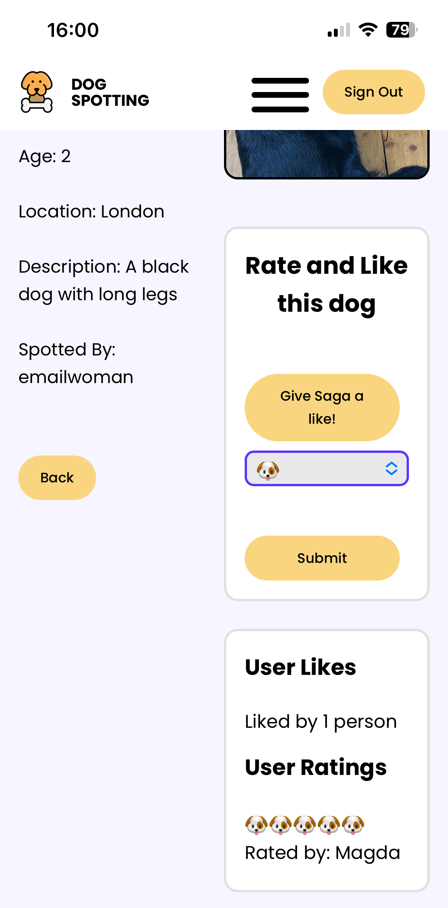 |  |

2. Authentication System
   
Built user registration and login pages with bcrypt password hashing and Express session management. Created middleware for route protection (isSignedIn, isSignedOut).

```js
// * POST - auth/sign-up - send info to database
router.post('/sign-up', async (req, res) => {
    try {
        const username = req.body.username
        const email = req.body.email
        const password = req.body.password
        const confirmPassword = req.body.confirmPassword
        if (password !== confirmPassword) throw new Error('Passwords do not match. Try again.')
        const usernameInDatabase = await User.findOne({ username: username })
        if (usernameInDatabase) throw new Error(`Username "${username}" already taken. Try a new one.`)
        const emailInDatabase = await User.findOne({ email: email })
        if (emailInDatabase) throw new Error(`Email "${email}" already in use. Try a new one.`)
        req.body.password = bcrypt.hashSync(password, 12)
        const newUser = await User.create(req.body)
        res.redirect('/auth/sign-in')
        console.log('User created')
    } catch (error) {
        console.log(error.message)
        res.render('auth/sign-up.ejs', { error: error.message })
    }
})
```

3. Ratings Feature
   
Developed a subdocument schema for ratings, allowing users to rate dog spots. Implemented logic to prevent multiple ratings and likes from the same user.

Backend:
```js
router.get('/:dogId', async (req, res) => {
    try {
        const dogId = req.params.dogId
        const dog = await Dog.findById(dogId)
            .populate('owner')
            .populate('ratings.user')
        const userHasLiked = dog.likedByUsers.some(user => {
            return user.equals(req.session.user._id)
        })
        const userHasRated = dog.ratings.some(rating => {
            return rating.user._id.equals(req.session.user._id)
        })
        res.render('dogs/show.ejs', { dog, user: req.session.user, userHasLiked, userHasRated })
    } catch (error) {
        console.error(error)
        return res.status(500).send('Something went wrong')
    }
})
```

Frontend:
```js
            <% if (user && !dog.owner._id.equals(user._id)) { %>
                <div class="rating-box">
                    <h2>Rate and Like this dog</h2>
                    <% if (userHasLiked) { %>
                        <form action="/dogs/<%= dog._id %>/liked-by/<%= user._id %>?_method=DELETE" method="POST">
                            <button class="btn"> Remove like </button>
                        </form>
                        <% } else { %>
                            <form action="/dogs/<%= dog._id %>/liked-by/<%= user._id %>" method="POST">
                                <button class="btn"> Give <%= dog.name %> a like! </button>
                            </form>
                            <% } %>
                                <% if (userHasRated) { %>
                                    <form action="/dogs/<%= dog._id %>/rating?_method=DELETE" method="POST">
                                        <button class="btn"> Remove Rating </button>
                                    </form>
                                    <% } else { %>
                                        <form action="/dogs/<%= dog._id %>/rating" method="POST">
                                            <select name="stars" id="stars" required>
                                                <option value="1">🐶</option>
                                                <option value="2">🐶🐶</option>
                                                <option value="3">🐶🐶🐶</option>
                                                <option value="4">🐶🐶🐶🐶</option>
                                                <option value="5">🐶🐶🐶🐶🐶</option>
                                            </select>
                                            <button class="btn">Submit</button>
                                        </form>
                                        <% } %>
                </div>
                <% } %>
```
| Rate Dog | Unrate Dog | 
|---------------------|---------------------|
|  |  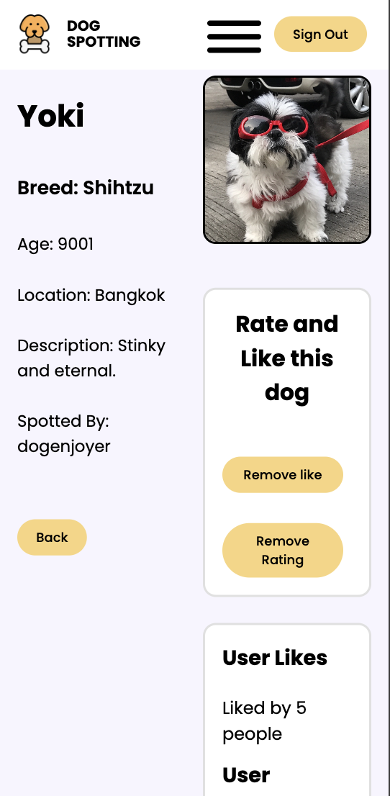 | 

4. Image Upload Integration
   
Integrated Multer for handling multipart/form-data and Cloudinary for cloud-based image storage. Created a custom buffer upload function to handle image processing.
```js
    if (req.file) {
    const uploadResult = await uploadBuffer(req.file.buffer)
    req.body.photoURL = uploadResult.secure_url
}
```
| Image Upload| 
|---------------------|
| 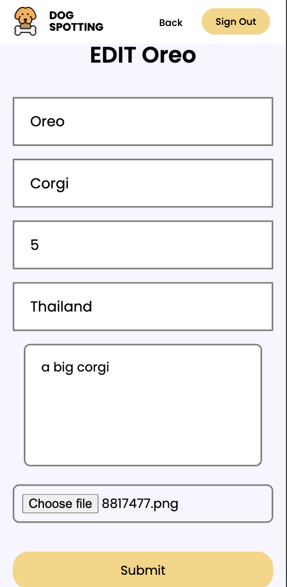 |

5. Like Functionality
   
Implemented a like/unlike system using MongoDB's $push and $pull operators to manage the likedByUsers array on dog documents.

```js

// * Add Favourite     
router.post('/:dogId/liked-by/:userId', isSignedIn, async (req, res) => {
    try {
        const dogId = req.params.dogId
        await Dog.findByIdAndUpdate(dogId, {
            $push: { likedByUsers: req.session.user._id },
        })
        res.redirect(`/dogs/${dogId}`)
    } catch (error) {
        console.error(error)
        res.status(500).send('Something went wrong. Please try again later.')
    }
})

// * Delete Favourite     
router.delete('/:dogId/liked-by/:userId', isSignedIn, async (req, res) => {
    try {
        const dogId = req.params.dogId
        await Dog.findByIdAndUpdate(dogId, {
            $pull: { likedByUsers: req.session.user._id },
        })
        res.redirect(`/dogs/${dogId}`)
    } catch (error) {
        console.error(error)
        res.status(500).send('Something went wrong. Please try again later.')
    }
})
```

6. Responsive Design
   
Created a mobile-first responsive design with a hamburger menu for navigation on smaller screens.

| Hamburger Menu | 
|---------------------|
| 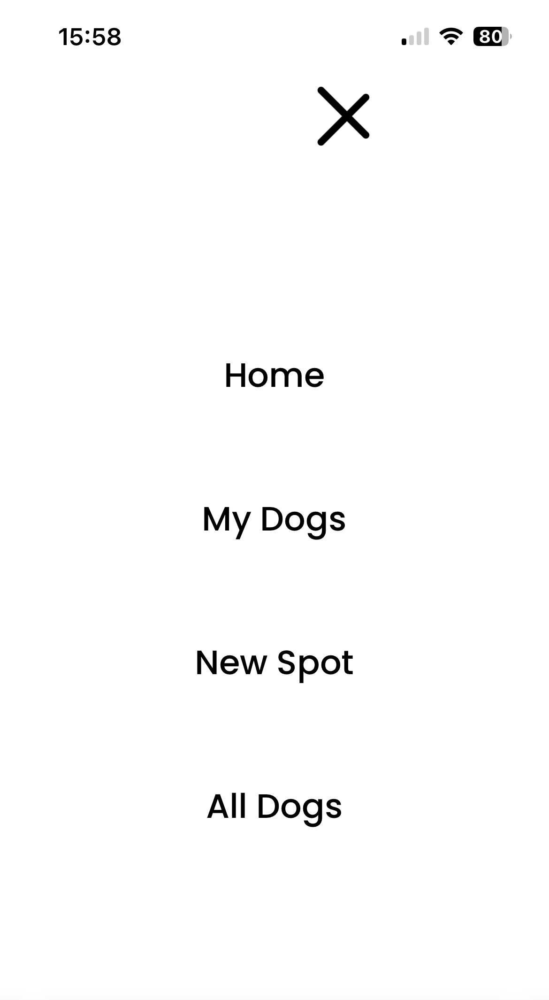 |

7. Authorization & Ownership Verification
    
Implemented authorization checks to ensure users can only edit or delete their own posts.

```js Verifying ownership before allowing updates

router.put('/:dogId', isSignedIn, upload.single('photoURL'), async (req, res) => {
    try {
        const dogId = req.params.dogId
        const dog = await Dog.findById(dogId)
        if (!dog.owner.equals(req.session.user._id)) {
            req.session.message = 'You do not have permission to edit this post'
            return res.redirect(`/dogs/${dogId}`)
        }
        if (req.file) {
            const uploadResult = await uploadBuffer(req.file.buffer)
            req.body.photoURL = uploadResult.secure_url
            console.log('Upload succesful', uploadResult)
        }

        const updatedDog = await Dog.findByIdAndUpdate(dogId, req.body)
        req.session.message = `Dog ${updatedDog.name} was successfully updated.`
        return res.redirect(`/dogs/${dogId}`)
    } catch (error) {
        console.error(error)
        res.status(500).send('Something went wrong. Please try again')
    }
})
```
8. Personal Dashboard
   
Created a dedicated page showing both owned and liked dog spots by querying multiple collections.
Fetching user's owned and liked dogs
```js
router.get('/my-dogs', isSignedIn, async (req, res) => {
    try {
        const ownedDogSpots = await Dog.find({ owner: req.session.user._id })
        const likedDogs = await Dog.find({ likedByUsers: req.session.user._id })
        res.render('dogs/my-dogs.ejs', { ownedDogSpots, likedDogs })
    } catch (error) {
        console.error(error)
        res.status(500).send('Something went wrong. Please try again later.')
    }
})
```
| No Dogs | Added Dogs| 
|---------------------|---------------------|
| 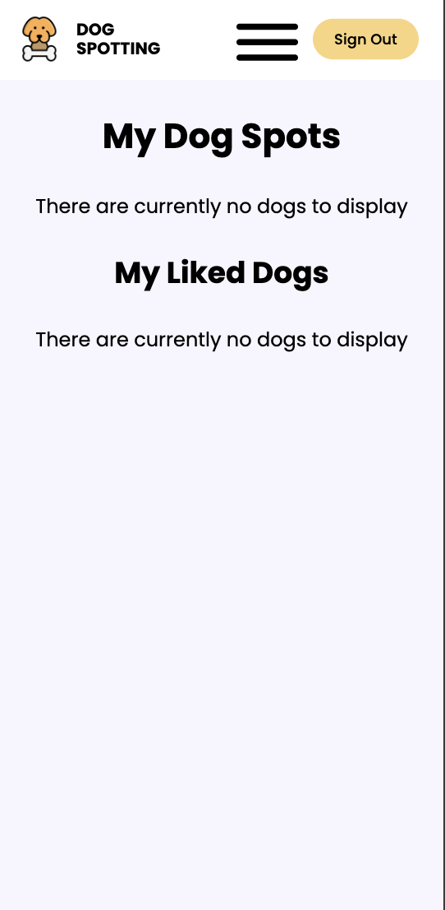 | 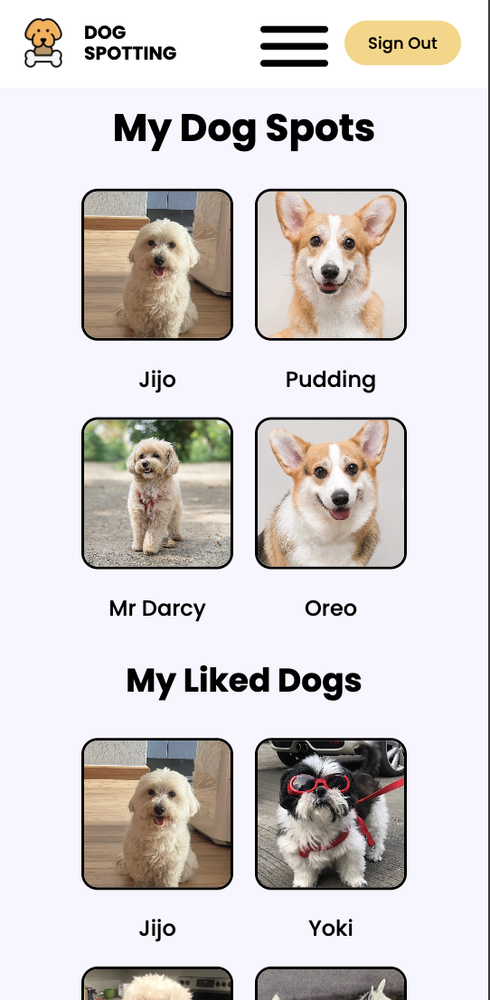 |

9. Error Handling
    
Added comprehensive try-catch blocks throughout the application with user-friendly error messages.

| Login Error | Username Error | Invalid Credentials Error | Email Error | 
|---------------------|---------------------|---------------------|---------------------|
| 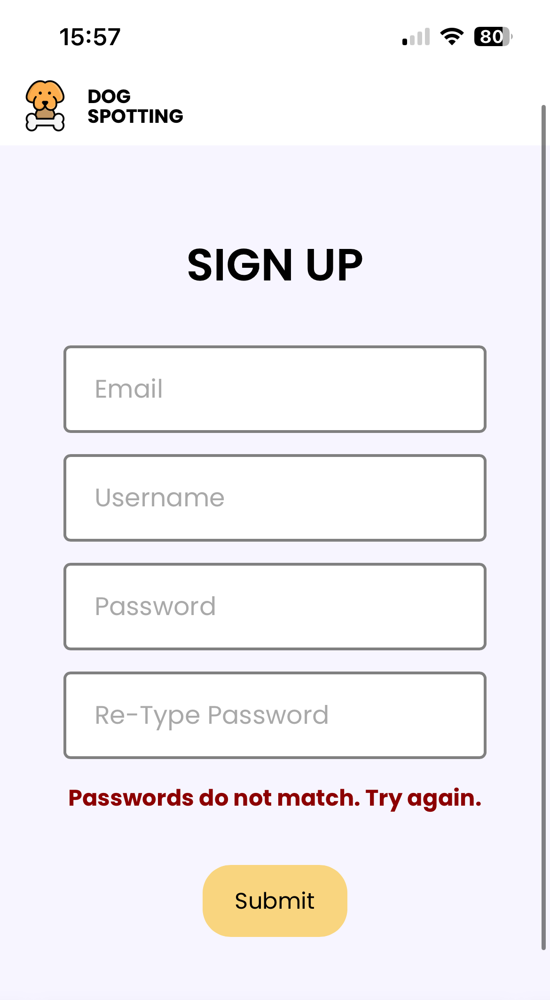 | 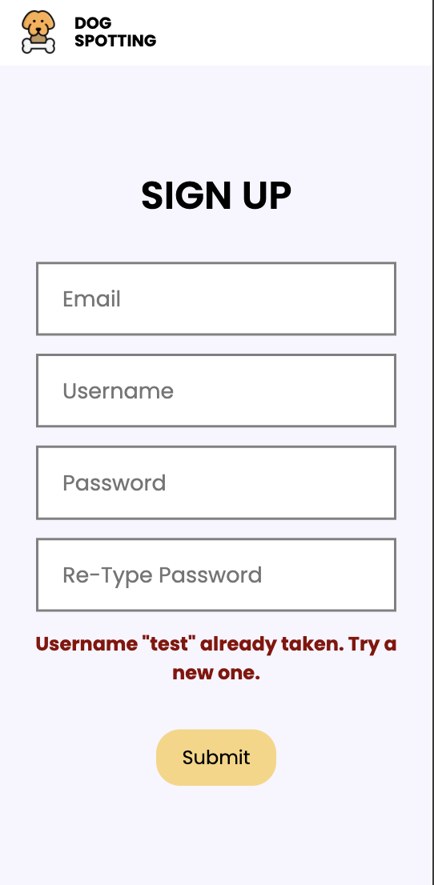 | 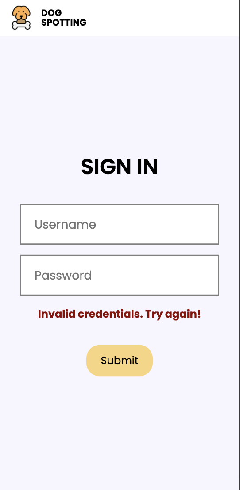 | 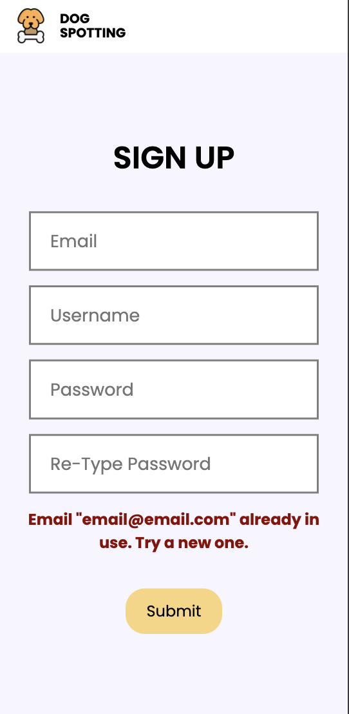 | 

## Challenges

- Image Upload Implementation: Initially struggled with Multer configuration and Cloudinary integration. Resolved by creating a custom buffer upload function that handles the file upload stream properly.
- Preventing Duplicate Ratings: Needed to implement logic to check if a user had already rated a dog spot before allowing another rating. Used MongoDB's array methods to verify user presence in the ratings array.
- Mobile Responsiveness: Ensuring the application looked good across all screen sizes required significant CSS adjustments and media queries.

## Wins

- Mobile Hamburger Menu: Successfully implemented a smooth, functional hamburger menu that enhances the mobile user experience without using external libraries.
- Complete Feature Set: Managed to implement all planned features within the one-week timeframe, including photo uploads, likes, and ratings.
- Clean Code Architecture: Maintained organized file structure and followed MVC patterns throughout, making the codebase maintainable and scalable.
- Deployment Success: Successfully deployed the application to Netlify, making it accessible to users worldwide.

## Key Learnings/Takeaways

- MEN Stack Proficiency: Gained solid understanding of building full-stack applications with MongoDB, Express, and Node.js.
- Session Management: Learned how to implement secure session-based authentication and protect routes with custom middleware.
- Cloud Storage Integration: Developed skills in integrating third-party services like Cloudinary for handling file uploads.
- Database Relationships: Deepened understanding of MongoDB relationships, including referenced documents and embedded subdocuments.
- Responsive Design: Improved CSS skills and learned best practices for creating mobile-first, responsive web applications.

## Known Bugs

- Some buttons briefly zoom in when clicked on mobile 

## Future Improvements

- Multiple Photo Support: Allow users to select one main profile photo and upload additional images to a gallery accessible on the spot detail page
- Average Ratings Display: Implement a main ratings bar showing the average of all user-submitted ratings for each spot
- Flash Messages (add confirmation messages for):
--User account creation
--Spot creation/update
--Sign out confirmation

- Account Management: Enable users to delete their account and profile
- Image Preview: Add real-time image preview in the create/edit post form before submission
- Comments: Add a commenting system for users to discuss dog spots
- Dark Mode

## Installation & Setup

1. Clone the repo
- git clone https://github.com/MCegla-JW/MEN-Stack-CRUD-App---DogSpotting---Project-2.git

2. Install dependencies
- npm install

3. Create .env file with the following variables:
 - MONGODB_URI=your_mongodb_connection_string
- SESSION_SECRET=your_session_secret
- PUBLIC_CLOUDINARY_CLOUD_NAME=your_cloudinary_name
- CLOUDINARY_API_KEY=your_cloudinary_key
- CLOUDINARY_API_SECRET=your_cloudinary_secret

4. Start the development server
- npm start
